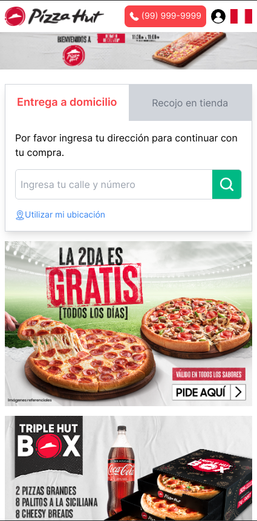
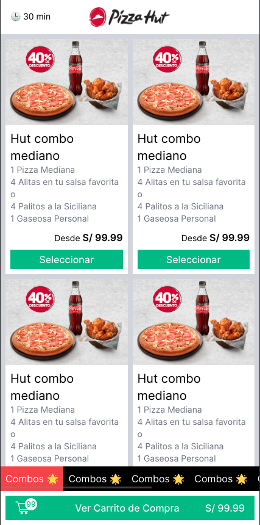
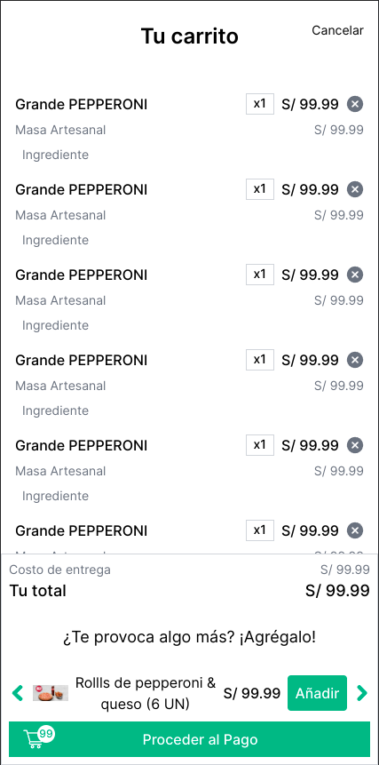
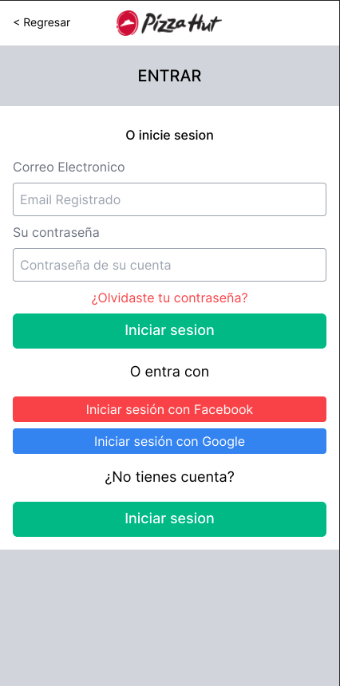
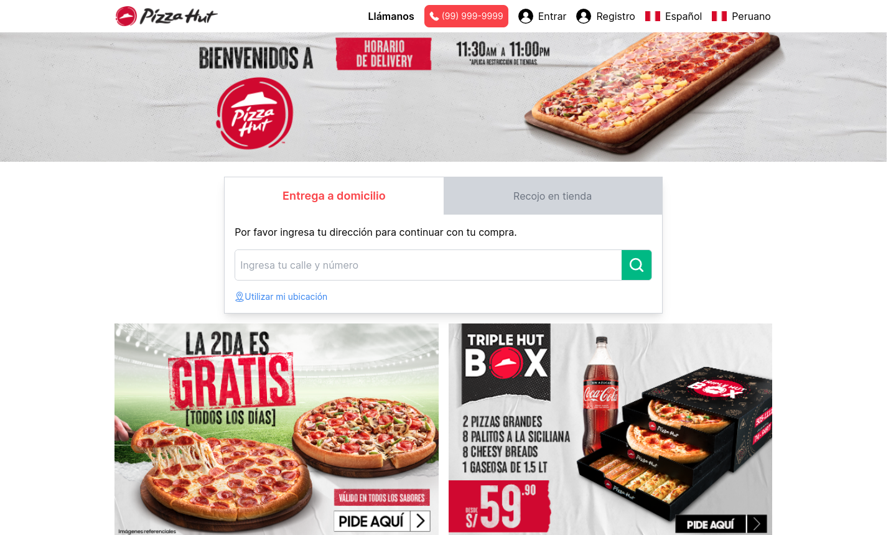
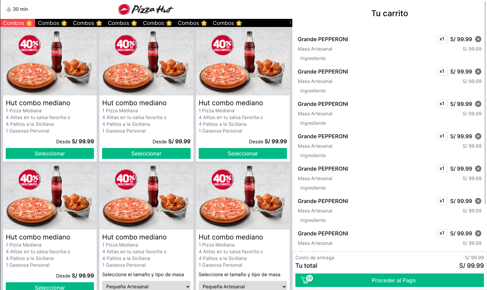
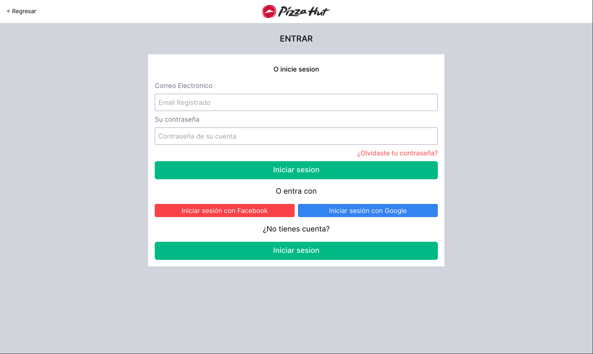
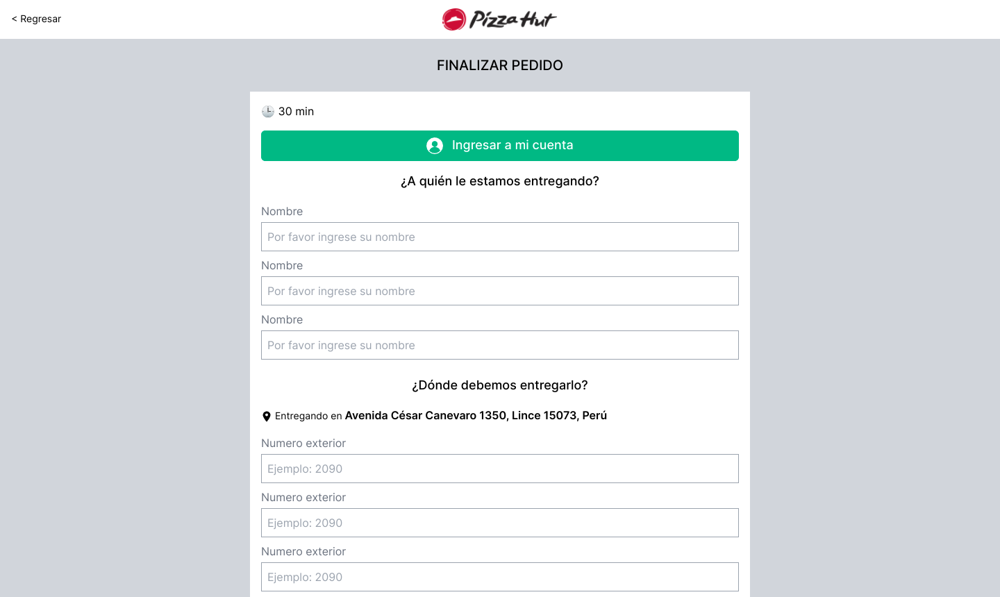

# PizzaHut Website Clone

A clone of the official `Pizza Hut Peru Website`, trying to imitate the main views of the website and keep the original responsive design.

## Table of contents

- [PizzaHut Website Clone](#pizzahut-website-clone)
  - [Table of contents](#table-of-contents)
  - [Motivation](#motivation)
  - [Technologies](#technologies)
  - [Screenshots](#screenshots)
  - [Installation](#installation)
  - [References](#references)

## Motivation

This project was made with the objective of practicing my skills using the Tailwind CSS framework, and discover their capabilities to make fully responsive and customizable websites. Also to experience the way of working with a utility first CSS framework.

## Technologies

Some of the main technologies that were used for building this project.

- [Vue.js](https://vuejs.org/)
- [Tailwind css](https://tailwindcss.com/)
- [Vite](https://vitejs.dev/)

<div style="display:flex;justify-content:center;gap:16px">

  
  
  
</div>

## Screenshots

Some of the main views of the project.

- Mobile views

<div style="display:grid;grid-template-columns:1fr 1fr 1fr 1fr;gap:2rem">









</div>

- Mobile views

<div style="display:grid;grid-template-columns:1fr 1fr;gap:2rem">









</div>

## Installation

```bash
# bash
# Install the dependencies
$ npm install

# Start developtment server
$ npm run dev

# Build project and generate static files
$ npm run build

# View generated files
$ npm run serve
```
For more details, you can check [Vite docs](https://vitejs.dev/guide/build.html)

## References

The documentation sites and other resources that help with the project.

- [Pizza Hut Peru Official Website](https://www.pizzahut.com.pe/)
- [Tailwind Docs](https://tailwindcss.com/docs/responsive-design)
